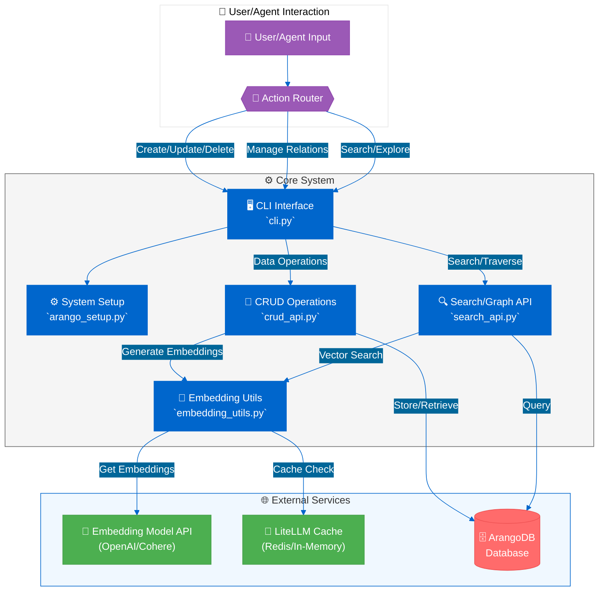

# 🔍 ArangoDB Lessons Learned Retriever

## 📋 Overview

A sophisticated system for managing and analyzing "lessons learned" using ArangoDB, combining advanced search capabilities with graph-based knowledge representation.

### 📥 Installation Steps

#### 1. Prerequisites
- Install Docker and Docker Compose: [Link to Docker Docs]

#### 2. Clone & Setup Environment
```bash
git clone <your-repo-url>
cd <your-repo-directory>
python -m venv .venv
source .venv/bin/activate # Windows: .venv\Scripts\activate
pip install -r requirements.txt


### 🎯 Key Features

#### Search Capabilities
- **🔎 Keyword Search**
  - Powered by ArangoSearch Views
  - Uses BM25 algorithm for relevance
- **🧠 Semantic Search**
  - Vector embeddings via LiteLLM
  - Cosine similarity matching
- **🔄 Hybrid Search**
  - Combines keyword and semantic results
  - Uses Reciprocal Rank Fusion (RRF)
- **📊 Graph Analysis**
  - Relationship-based storage
  - Advanced graph traversal

### 💡 Core Functionality

#### Data Management
- **📝 Multi-modal Search Engine**
  - BM25, Vector, and Hybrid search
  - Customizable relevance scoring
- **🗃️ Graph Database Integration**
  - Lessons stored as vertices
  - Relationships as edges
  - Flexible schema design

#### Advanced Features
- **🔗 Relationship Management**
  - CRUD operations for links
  - Support for RELATED, DUPLICATE, CAUSAL types
- **🤖 Automatic Processing**
  - Vector embedding generation
  - LiteLLM integration (OpenAI, Cohere)
- **⚡ Performance Optimization**
  - Redis caching system
  - In-memory fallback option
  - Reduced API calls and latency

#### Developer Tools
- **🛠️ CRUD API**
  - Python function library
  - Vertex and edge management
- **💻 Command-Line Interface**
  - User-friendly `cli.py`
  - Full functionality access
  - Agent integration support
- **⚙️ Easy Configuration**
  - Environment variable driven
  - Flexible deployment options

## Architecture & Flow

The following diagram illustrates the typical workflows for adding/updating lessons and performing searches or graph traversals:



**(Note: The diagram above represents the complete system flow, with enhanced visual elements and clearer relationships between components.)**

### 🔄 System Workflow Explanation

The diagram above illustrates the key components and data flows in the system. Here's a detailed breakdown:

#### 1. 📥 Input Processing
- **Initial Interaction**
  - Users/agents interact through CLI (`cli.py`)
  - Commands are validated and parsed
  - Actions routed to appropriate handlers

#### 2. 🎯 Command Processing
- **Route Selection**
  - CLI directs to specific API modules:
    - `crud_api.py` for data management
    - `search_api.py` for search/traversal
- **Operation Handling**
  - Each module processes its specialized operations
  - Maintains separation of concerns

#### 3. 🧮 Data Processing
- **Embedding Generation**
  - Text vectorization via `embedding_utils.py`
  - Integration with external APIs
  - Automatic caching for efficiency
- **Cache Management**
  - Managed by `initialize_litellm_cache.py`
  - Redis primary / In-memory fallback
  - Optimizes API usage and latency

#### 4. 💾 Storage Operations
- **Database Management**
  - CRUD operations through `crud_api.py`
  - Collection/vertex/edge handling
  - Graph structure maintenance
- **Search & Retrieval**
  - BM25/Semantic/Hybrid search via Views
  - Graph traversal capabilities
  - Efficient query processing

#### 5. 🤖 Agent Integration
- **Automated Processing**
  - Relationship detection
  - Pattern recognition
  - Smart content linking
- **Graph Enhancement**
  - Dynamic relationship creation
  - Automated maintenance
  - Structure optimization

## 📂 Project Structure

### 🗃️ Project Layout
```
src/mcp_doc_retriever/arangodb/
├── 📄 __init__.py
├── 🔌 arango_setup.py        # Database connection & setup
├── 🖥️ cli.py                 # CLI using Typer
├── ⚙️ config.py              # Environment configuration
├── 📝 crud_api.py            # CRUD operations handler
├── 🧮 embedding_utils.py      # Text embedding utilities
├── 💾 initialize_litellm_cache.py # Cache configuration
├── 📚 main_usage.py          # Usage examples
├── 🔍 search_api.py          # Search & traversal functions
└── 📋 sample_data.py         # Optional test data
```

### 📦 Support Files
```
📄 .env                    # Environment variables (private)
📖 README.md              # Documentation (this file)
📋 requirements.txt       # Project dependencies
```

> ⚠️ **Security Note:** Never commit `.env` to version control

## 🛠️ Setup & Installation

### System Requirements

#### 📚 Core Dependencies
- **🐍 Python**
  - Version: 3.9 or higher
  - Purpose: Runtime environment

- **🗄️ ArangoDB**
  - Version: v3.8+ recommended
  - Options: Local, Docker, or cloud
  - Role: Primary database system

#### ⚡ Optional Components
- **📦 Redis**
  - Purpose: Persistent caching
  - Use Case: Improved performance
  - Status: Optional component

- **🔑 API Access**
  - Provider: OpenAI/Cohere
  - Required: Embedding API key
  - Usage: Vector generation

### 📥 Installation Steps

#### 1. Project Setup
```bash
# Clone Repository
git clone <your-repo-url>
cd <your-repo-directory>

# Create Virtual Environment
python -m venv .venv
source .venv/bin/activate  # Windows: .venv\Scripts\activate

# Install Dependencies
pip install -r requirements.txt
```

#### 2. 🔧 Environment Configuration
Create `.env` file in project root:

```dotenv
# 🗄️ ArangoDB Settings
ARANGO_HOST="http://localhost:8529"
ARANGO_USER="root"
ARANGO_PASSWORD="your_password"  # Change this!
ARANGO_DB_NAME="doc_retriever"

# 🤖 Embedding Configuration
EMBEDDING_MODEL="text-embedding-3-small"
OPENAI_API_KEY="sk-..."  # Your API key here

# 💾 Redis Settings (Optional)
# REDIS_HOST="localhost"
# REDIS_PORT="6379"
# REDIS_PASSWORD=""  # Set if needed

# 📝 System Settings
LOG_LEVEL="INFO"  # Options: DEBUG, INFO, WARNING, ERROR

# 🔄 Optional Configurations
# ARANGO_EDGE_COLLECTION="lesson_relationships"
# ARANGO_GRAPH="lessons_graph"
```

> ⚠️ **Security Note:** Never commit `.env` file to version control

#### 3. 🔍 Verification Steps
1. Ensure ArangoDB is running
2. Verify Python environment
3. Test API key access
4. Optional: Check Redis connection

## ⚙️ Configuration

### 🔧 Environment Setup
Configuration is managed through environment variables (loaded from `.env`):

#### 🗄️ Core Settings
- Defined in: `src/mcp_doc_retriever/arangodb/config.py`
- Loading: Automatic from `.env` if present
- Priority: Environment values override defaults

#### 📝 Configuration Flow
1. Load default values
2. Check `.env` file
3. Override with environment variables
4. Validate required settings

> 📌 **Tip:** See Setup section for detailed variable list

## 🚀 System Usage

### 💻 Command-Line Interface (CLI)

#### Overview
The CLI provides the primary interface for human users and automated agents:

#### 🔄 Basic Command Structure
```bash
python -m src.mcp_doc_retriever.arangodb.cli [OPTIONS] COMMAND [ARGS]...
```
### 📝 Command Examples

#### 🔍 Search Operations
```bash
# Hybrid Search with JSON Output
python -m src.mcp_doc_retriever.arangodb.cli search hybrid \
  "fix docker network issue" \
  --tags "docker" \
  -n 3 -j
```

#### 📋 Lesson Management
##### Adding a Lesson (Recommended: Using a File)
1. Create a JSON file (e.g., `new_lesson.json`):
```json
{
  "problem": "Cannot connect to database from container",
  "solution": "Check firewall rules and container network settings. Ensure DB allows connections from container IP range.",
  "tags": ["database", "network", "docker", "firewall"],
  "severity": "HIGH",
  "role": "DevOps"
}
```

2. Run the command:
```bash
python -m src.mcp_doc_retriever.arangodb.cli crud add-lesson \
  --data-file new_lesson.json -j
```

##### Adding a Lesson (Alternative Method)
```bash
# Using a String (Use with caution due to shell escaping)
python -m src.mcp_doc_retriever.arangodb.cli crud add-lesson \
  --data '{ "problem": "Simple CLI test", "solution": "Provide data as string.", "tags": ["cli", "test"] }'
```

##### Lesson Operations
```bash
# Retrieve a Lesson
python -m src.mcp_doc_retriever.arangodb.cli crud get-lesson <lesson_key>

# Delete a Lesson (with confirmation bypass)
python -m src.mcp_doc_retriever.arangodb.cli crud delete-lesson <lesson_key> --yes -j
```

##### Updating a Lesson
1. Create update file (`update_data.json`):
```json
{
  "severity": "MEDIUM",
  "tags": ["database", "network", "docker", "firewall", "updated"],
  "context": "Added context after resolving."
}
```

2. Run update:
```bash
python -m src.mcp_doc_retriever.arangodb.cli crud update-lesson <lesson_key> \
  --data-file update_data.json -j
```

#### 🔗 Graph Operations
```bash
# Create Relationship
python -m src.mcp_doc_retriever.arangodb.cli graph add-relationship \
  <key1> <key2> \
  --rationale "Key1 problem caused Key2 symptom" \
  --type CAUSAL -j

# Delete Relationship (with confirmation bypass)
python -m src.mcp_doc_retriever.arangodb.cli graph delete-relationship <edge_key> --yes -j

# Graph Traversal
python -m src.mcp_doc_retriever.arangodb.cli graph traverse \
  lessons_learned/<key1> \
  --max-depth 2 \
  --direction ANY
```

##### 🔗 Graph Operations
```bash
# Create Relationship
python -m src.mcp_doc_retriever.arangodb.cli graph add-relationship \
    <key1> <key2> \
    --rationale "Key1 problem caused Key2 symptom" \
    --type CAUSAL

# Graph Traversal
python -m src.mcp_doc_retriever.arangodb.cli graph traverse \
    lessons_learned/<key1> \
    --max-depth 2 \
    --direction ANY
```

#### 📚 Help & Documentation

```bash
# 📖 General Help
python -m src.mcp_doc_retriever.arangodb.cli --help

# 🔍 Search Commands
python -m src.mcp_doc_retriever.arangodb.cli search --help

# 💾 CRUD Operations
python -m src.mcp_doc_retriever.arangodb.cli crud --help

# 🕸️ Graph Commands
python -m src.mcp_doc_retriever.arangodb.cli graph --help
```

> 📘 **Note:** See `cli.py` docstrings for comprehensive command reference

### 🔧 API Integration

#### Python API Usage
- 📄 Example Script: `main_usage.py`
- 🚀 Run Example:
  ```bash
  python -m src.mcp_doc_retriever.arangodb.main_usage
  ```

#### Features Demonstrated
- ⚙️ System configuration
- 📝 CRUD operations
- 🔗 Relationship management
- 🔍 Search capabilities
- 📊 Graph traversal
- 📋 Results logging

## 🧠 Core Concepts

### Search Technologies
#### 📊 BM25 Search
- **Description:** Advanced keyword-based ranking algorithm
- **Key Features:**
  - Term frequency scoring
  - Inverse document frequency weighting
  - Exact match optimization
- **Best For:** Precise keyword matching

#### 🔍 Semantic Search
- **Description:** Meaning-based document retrieval
- **Components:**
  - Vector embeddings for text
  - Cosine similarity matching
  - Conceptual understanding
- **Advantages:** Finds related content without exact matches

#### 🔄 Hybrid Search
- **Description:** Combined search approach using RRF
- **Process:**
  - Runs both BM25 and semantic search
  - Merges results via Reciprocal Rank Fusion
  - Optimizes for relevance
- **Benefits:** More robust than single methods

### Data Architecture
#### 📐 Graph Database
- **Components:**
  - Lessons as graph vertices
  - Relationships as edges
  - Flexible connection types
- **Relationships:**
  - Duplicates
  - Dependencies
  - Causal links
- **Benefits:**
  - Rich relationship modeling
  - Complex query support
  - Pattern discovery

#### ⚡ LiteLLM Integration
- **Features:**
  - Unified API interface
  - Multiple provider support
  - Built-in caching
- **Supported Services:**
  - OpenAI
  - Cohere
  - Azure
- **Optimization:**
  - Reduced API calls
  - Lower latency
  - Better resource usage

## 🔮 Future Enhancements

### 📊 Advanced Analytics
- **🕸️ Graph Algorithms**
  - PageRank implementation
  - Community detection
  - Pattern analysis
- **📈 Relationship Enhancement**
  - Confidence scoring
  - Weight customization
  - Dynamic adjustment

### 🛠️ Technical Improvements
- **🔍 Search Capabilities**
  - Enhanced ArangoSearch views
  - Fine-grained query control
  - Custom scoring functions
- **🚀 Performance Optimization**
  - Asynchronous API calls
  - Parallel processing
  - Resource optimization

### 🤖 Integration & Testing
- **🔗 Framework Integration**
  - LangChain support
  - LlamaIndex compatibility
  - Agent development tools
- **✅ Quality Assurance**
  - Comprehensive test suite
  - Integration testing
  - Performance benchmarks

---