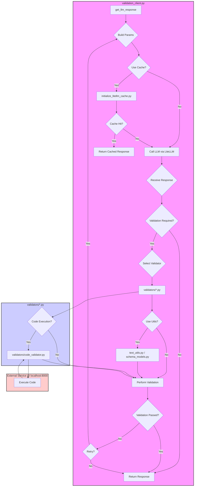

# Code Executor & Validation Client

This package provides tools for interacting with Large Language Models (LLMs) via LiteLLM, focusing on robust response validation and controlled code execution.

## Overview

The primary goal of this package is to facilitate reliable interactions with LLMs by:
1.  Making asynchronous batch calls to various LLM endpoints (local or remote).
2.  Validating the LLM responses against predefined criteria.
3.  Executing generated code snippets in a controlled environment.
4.  Implementing retry logic for failed validations.
5.  Utilizing caching (Redis with in-memory fallback) for efficiency.

## Workflow Diagram



## Directory Structure

```
src/pdf_extractor/code_executor/
├── README.md
├── __init__.py
├── demo.py
├── initialize_litellm_cache.py
├── schema_models.py
├── text_utils.py
├── validation_client.py
└── validators/
    ├── __init__.py
    ├── code_validator.py
    └── corpus_validator.py
```

## Key Components

*   **`validation_client.py`**:
    *   Contains the core asynchronous client function `get_llm_response`.
    *   Manages batch processing of LLM calls with concurrency control (`asyncio.Semaphore`).
    *   Integrates various validation strategies defined in the `validators` sub-package.
    *   Implements retry logic with prompt modification based on validation failures.
    *   Handles timeouts for LLM calls.
    *   Includes a `__main__` block for basic standalone testing against a real LLM endpoint.

*   **`validators/`** (Sub-package):
    *   **`code_validator.py`**:
        *   Provides `validate_code_execution` to run code snippets via an external code execution service (defaults to `http://localhost:8000`). It checks exit codes and optionally compares `stdout` against expected output.
        *   Includes `extract_code_from_text` to pull code blocks (e.g., Python) from LLM text responses.
        *   Contains a `CodeExecutorClient` class for interacting with the execution service.
        *   Includes a `__main__` block for standalone testing against the code execution service.
    *   **`corpus_validator.py`**:
        *   Provides `validate_corpus_match` to check if an LLM response closely matches any text within a provided corpus using fuzzy matching (`rapidfuzz`).
        *   Calculates similarity scores using various methods (token set, token sort, partial, simple ratio).
        *   Includes a `__main__` block for standalone testing of the fuzzy matching logic.

*   **`schema_models.py`**:
    *   Defines Pydantic models (`QuestionAnswer`, `CodeResponse`) used for enforcing and validating structured JSON responses from LLMs.
    *   Includes a `__main__` block for testing model instantiation, validation, and JSON serialization/deserialization.

*   **`initialize_litellm_cache.py`**:
    *   Configures LiteLLM's global caching mechanism.
    *   Attempts to connect to Redis (using environment variables `REDIS_HOST`, `REDIS_PORT`, `REDIS_PASSWORD`) and falls back to in-memory caching if Redis is unavailable.
    *   Includes a `__main__` block that tests cache initialization and basic cache hit/miss functionality using a real LLM call.

*   **`text_utils.py`**:
    *   Provides utility functions for text processing, such as `highlight_matching_words` used by the validators for clearer logging.
    *   Includes a `__main__` block for standalone testing of its functions.

*   **`demo.py`**:
    *   A standalone script demonstrating the usage of the validation functions (`validate_code_execution`, `extract_code_from_text`, `validate_corpus_match`) with predefined inputs, *without* making actual LLM calls. Useful for quick checks of the validator logic itself.

## Validation Strategies

The `validation_client.py` supports multiple validation types specified within the input call dictionary:

*   **`exact`**: Checks if the response (or a specific field) exactly matches the expected string (case-insensitive).
*   **`list`**: Checks if the response (or a specific field) is present within a list of allowed string values (case-insensitive). Can optionally also check against a specific `expected` value within the list.
*   **`fuzzy`**: Checks if the response (or a specific field) has a high similarity score (using `rapidfuzz`) compared to an expected string.
*   **`corpus`**: Checks if the response (or a specific field) has a high similarity score compared to any paragraph within a provided text corpus.
*   **`code_execution`**: Extracts code from the response (or a specific field), executes it using the `code_validator`, checks the exit code, and optionally verifies if `stdout` contains an expected string.
*   **Automatic Code Execution**: If a response uses a schema with a field named `code` and passes its primary validation (e.g., `exact`, `list`), the client automatically attempts to execute the code as an additional check.

## Usage

The main entry point for using this package is the `get_llm_response` function in `validation_client.py`. It takes a list of call dictionaries, each specifying the model, prompt, and optional validation criteria.

```python
# Example usage (conceptual)
from pdf_extractor.llm_client.validation_client import get_llm_response
from pdf_extractor.llm_client.schema_models import QuestionAnswer, CodeResponse
import asyncio

async def main():
    calls = [
        {
            "model": "gpt-4o-mini",
            "prompt": "What is the capital of France? Respond concisely.",
            "validation": {"type": "exact", "expected": "Paris"}
        },
        {
            "model": "gpt-4o-mini",
            "prompt": "Generate Python code to print numbers 1 to 3.",
            "response_schema": CodeResponse, # Expect structured output
            "validation": {
                "type": "code_execution",
                "expected_output": "1\n2\n3", # Check stdout
                "field": "code" # Specify which field contains the code
            }
        }
    ]
    results = await get_llm_response(calls)
    for prompt, response in results:
        print(f"Prompt: {prompt}\nResponse: {response}\n---")

if __name__ == "__main__":
    asyncio.run(main())
```

## Dependencies & Documentation

*   **LiteLLM**: For interacting with various LLM APIs.
    *   Docs: [https://docs.litellm.ai/](https://docs.litellm.ai/)
    *   Caching: [https://docs.litellm.ai/docs/proxy/caching](https://docs.litellm.ai/docs/proxy/caching)
*   **Loguru**: For logging.
    *   Docs: [https://github.com/Delgan/loguru](https://github.com/Delgan/loguru)
*   **Tenacity**: For retry logic.
    *   Docs: [https://tenacity.readthedocs.io/en/latest/](https://tenacity.readthedocs.io/en/latest/)
*   **tqdm**: For progress bars during batch processing.
    *   Docs: [https://github.com/tqdm/tqdm](https://github.com/tqdm/tqdm)
*   **Pydantic**: For schema definition and validation.
    *   Docs: [https://docs.pydantic.dev/](https://docs.pydantic.dev/)
*   **RapidFuzz**: For fuzzy string matching.
    *   Docs: [https://github.com/maxbachmann/RapidFuzz](https://github.com/maxbachmann/RapidFuzz)
*   **Redis**: (Optional) For distributed caching.
    *   Python Client Docs: [https://redis.io/docs/clients/python/](https://redis.io/docs/clients/python/)
*   **HTTPX**: For making requests to the code execution service.
    *   Docs: [https://www.python-httpx.org/](https://www.python-httpx.org/)
*   **python-dotenv**: For loading environment variables.
    *   Docs: [https://github.com/theskumar/python-dotenv](https://github.com/theskumar/python-dotenv)

## Standalone Validation

Each Python module includes an `if __name__ == "__main__":` block that performs basic validation checks specific to that module's functionality. These can be run directly using `uv run <script_name>.py` and are designed to pass if the module is working correctly, adhering to the project's validation standards.